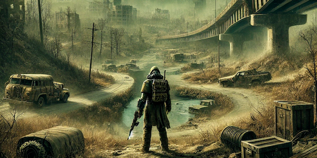

 

 

 

# The Echoes of Wasteland
A Goo Game! 😜

See <big>[**Echoes of Wasteland**](https://gervi-hera-vitr.github.io/the-echoes-of-wasteland/ "The Echoes of Wasteland") Site</big> for more information.
Here at the root of the project we're maintaining technical contribution aspects of the project. 

Welcome, Friends!

